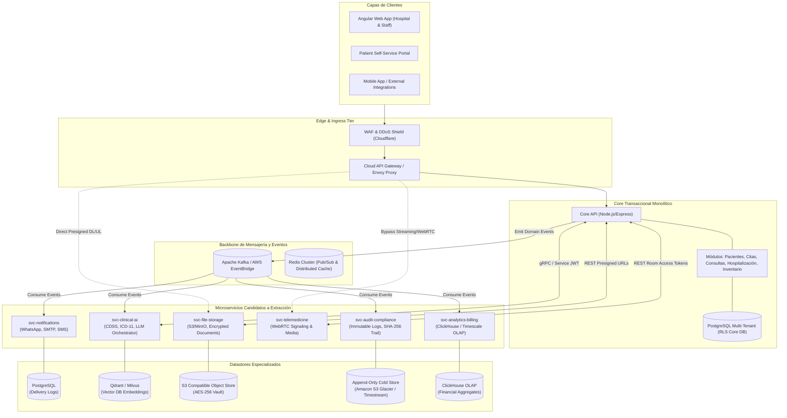
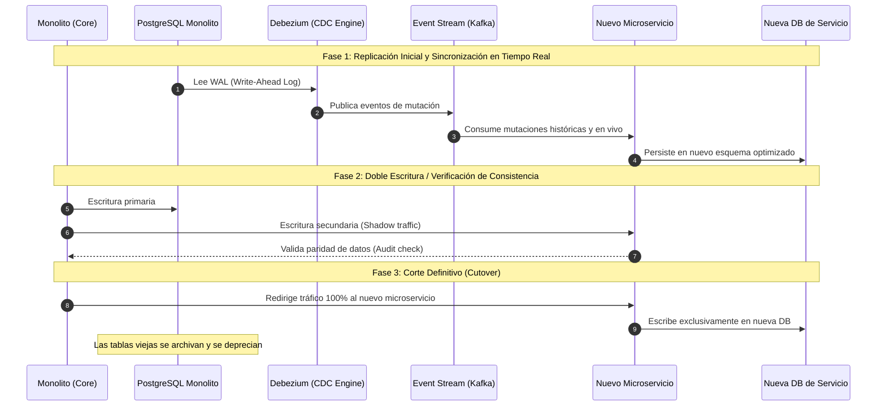

# 🏛️ Especificación y Diseño Arquitectónico de Futuros Microservicios

> **Proyecto:** Clinica-SaaS / Medicusve  
> **Versión:** 4.4.0 (Post-Fase 26)  
> **Estado:** Documento Normativo de Evolución Arquitectónica (Fase 27)  
> **Patrón Base:** Monolito Modular Multi-Tenant $\rightarrow$ Extracción Orientada a Eventos (*Strangler Fig Pattern*)

---

## 📑 Tabla de Contenidos

1. [Visión Estratégica y Principios de Desacoplamiento](#1-visión-estratégica-y-principios-de-desacoplamiento)
2. [Diagrama General de Arquitectura Objetivo](#2-diagrama-general-de-arquitectura-objetivo)
3. [Catálogo de Microservicios Candidatos a Extracción](#3-catálogo-de-microservicios-candidatos-a-extracción)
   - [3.1 `svc-notifications`: Servicio Omnicanal de Comunicaciones](#31-svc-notifications-servicio-omnicanal-de-comunicaciones)
   - [3.2 `svc-clinical-ai`: Servicio de Asistencia Clínica y CDSS](#32-svc-clinical-ai-servicio-de-asistencia-clínica-y-cdss)
   - [3.3 `svc-file-storage`: Servicio de Gestión y Custodia de Archivos Médicos](#33-svc-file-storage-servicio-de-gestión-y-custodia-de-archivos-médicos)
   - [3.4 `svc-telemedicine`: Señalización WebRTC y Sesiones Virtuales](#34-svc-telemedicine-señalización-webrtc-y-sesiones-virtuales)
   - [3.5 `svc-audit-compliance`: Custodia Inmutable y Auditoría Forense](#35-svc-audit-compliance-custodia-inmutable-y-auditoría-forense)
   - [3.6 `svc-analytics-billing`: Inteligencia Financiera y Liquidaciones](#36-svc-analytics-billing-inteligencia-financiera-y-liquidaciones)
4. [Estrategia de Persistencia y Migración de Datos (Zero-Downtime)](#4-estrategia-de-persistencia-y-migración-de-datos-zero-downtime)
5. [Seguridad Inter-Servicios y Propagación de Contexto (Zero-Trust)](#5-seguridad-inter-servicios-y-propagación-de-contexto-zero-trust)
6. [Resiliencia, Circuit Breakers y Degeneración Agraciada](#6-resiliencia-circuit-breakers-y-degeneración-agraciada)
7. [Matriz de Priorización y Criterios Operacionales de Disparo](#7-matriz-de-priorización-y-criterios-operacionales-de-disparo)

---

## 1. Visión Estratégica y Principios de Desacoplamiento

El sistema **Clinica-SaaS** opera actualmente sobre una arquitectura de **Monolito Modular Multi-Tenant** endurecido, con aislamiento a nivel de base de datos mediante **PostgreSQL Row-Level Security (RLS)** y comunicación desacoplada a través de un **Domain Event Bus canónico** en memoria ([`domainEvents.js`](file:///d:/projects/clinica-saas/server/src/events/domainEvents.js)).

### ¿Por qué NO extraer microservicios prematuramente?
1. **Sobrecarga de Red y Consistencia Distribuida:** Las transacciones transaccionales ACID clínicas (ej. alta médica con descarga simultánea de inventario farmacológico) son críticas y costosas de coordinar en sistemas distribuidos (*Two-Phase Commit* o *Sagas complejas*).
2. **Complejidad Operacional:** Cada microservicio independiente incrementa la superficie de monitoreo, despliegues CI/CD, balanceo de carga y consumo de recursos base.

### Criterio de Extracción (*Strangler Fig Pattern*):
La extracción a microservicios autónomos **únicamente ocurrirá** cuando un Bounded Context alcance uno o más de los siguientes **disparadores operacionales cuantitativos**:
- **Escala asimétrica de recursos:** El módulo consume CPU/Memoria en órdenes de magnitud superiores al núcleo transaccional (ej. inferencia LLM en IA o transcodificación de medios).
- **Ciclos de liberación desacoplados:** Módulos que requieren despliegues continuos diarios sin arriesgar el core clínico (ej. conectores y plantillas de WhatsApp/Email).
- **Aislamiento de fallo (*Blast Radius*):** El colapso del proveedor externo no debe comprometer la operación ambulatoria de la clínica.
- **Requisitos regulatorios de custodia aislada:** Retención inmutable a 10 años (Auditoría e Historias Clínicas) con llaves KMS separadas.

---

## 2. Diagrama General de Arquitectura Objetivo



---

## 3. Catálogo de Microservicios Candidatos a Extracción

---

### 3.1 `svc-notifications`: Servicio Omnicanal de Comunicaciones

#### Bounded Context & Justificación
Responsable exclusivo de la orquestación, templating, enrutamiento, reintentos y entrega de mensajes hacia canales externos (WhatsApp Cloud API / Twilio, Email vía SMTP / Resend, y Push Notifications). Centraliza las cuotas de mensajería, plantillas validadas por Meta y webhooks de entrega/lectura.

#### Disparadores Operacionales de Extracción (Triggers)
1. **Volumen de Mensajería:** Tráfico superior a **100,000 notificaciones/día** o picos de recordatorios masivos (campañas matutinas) que saturan el pool de conexiones del monolito.
2. **Latencia Externa y Webhooks:** El procesamiento de callbacks y eventos de estado (`sent`, `delivered`, `read`, `failed`) de Meta/Twilio introduce fluctuaciones de carga que no deben competir con transacciones clínicas.
3. **Desacoplamiento de Fallos de Proveedor:** Caídas de APIs externas o rate-limits de WhatsApp no deben degradar la reserva de citas en tiempo real.

#### Protocolos de Comunicación & Contratos de Datos

##### A) API Síncrona (REST / gRPC)
- `POST /api/v1/notifications/send`
```json
{
  "tenantId": "org-uuid-12345",
  "correlationId": "corr-uuid-abcdef",
  "channel": "WHATSAPP",
  "recipient": "+584121234567",
  "template": {
    "name": "appointment_reminder_24h",
    "language": "es",
    "parameters": {
      "patientName": "Juan Pérez",
      "doctorName": "Dr. Carlos Mendoza",
      "appointmentDate": "2026-10-15T10:00:00Z",
      "specialty": "Cardiología",
      "calendarUrl": "https://calendar.google.com/...",
      "portalUrl": "https://clinica.app/portal/citas/123"
    }
  },
  "priority": "HIGH"
}
```

##### B) Event-Driven Asíncrono
- **Eventos Consumidos del Broker:**
  - `Appointment.Scheduled` $\rightarrow$ Programa recordatorio preventivo 24h/2h antes.
  - `Appointment.Cancelled` $\rightarrow$ Envía confirmación de cancelación y libera slots.
  - `Waitlist.OfferSent` $\rightarrow$ Envía invitación interactiva por WhatsApp al paciente en espera.
  - `Clinical.PrescriptionIssued` $\rightarrow$ Envía enlace cifrado temporal con el récipe firmado y código QR.
- **Eventos Producidos hacia el Broker:**
  - `Communication.Sent`
  - `Communication.Delivered`
  - `Communication.Failed` (con código de error del proveedor y conteo de reintentos).

#### Datastore & Persistencia
- **Motor:** PostgreSQL dedicado independiente (`db_notifications`).
- **Esquema:** Tablas `outbound_messages`, `delivery_receipts`, `channel_templates`, `suppression_list` (números/emails rebotados).

---

### 3.2 `svc-clinical-ai`: Servicio de Asistencia Clínica y CDSS

#### Bounded Context & Justificación
Motor de soporte a la decisión clínica (CDSS) que encapsula la inferencia sobre Modelos de Lenguaje (LLMs locales o remotos), agentes autónomos (CrewAI), generación de borradores clínicos, sugerencias de codificación CIE-11 y análisis de interacciones fármaco-fármaco. Aplica la directiva ética estricta: **"El médico siempre revisa y aprueba; la IA asiste pero nunca toma decisiones vinculantes"**.

#### Disparadores Operacionales de Extracción (Triggers)
1. **Consumo de Cómputo Asimétrico:** La inferencia en modelos locales (vLLM / Ollama con GPU Nvidia) o la orquestación multi-paso de agentes consume memoria y tiempo de CPU que pueden asfixiar al API web principal.
2. **Latencia Heterogénea:** Tiempos de respuesta de inferencia de 2 a 15 segundos que requieren pipelines asíncronos o streaming vía SSE (*Server-Sent Events*).
3. **Escalado Horizontal Basado en GPUs:** Necesidad de desplegar pods en nodos de Kubernetes especializados con aceleración por hardware (`nvidia.com/gpu`).

#### Protocolos de Comunicación & Contratos de Datos

##### A) API Síncrona (gRPC / Protocol Buffers)
```protobuf
syntax = "proto3";
package clinical.ai.v1;

service ClinicalAiService {
  rpc GenerateClinicalBrief (ClinicalBriefRequest) returns (ClinicalBriefResponse);
  rpc SuggestIcd11Codes (Icd11Request) returns (Icd11Response);
  rpc CheckDrugInteractions (DrugInteractionRequest) returns (DrugInteractionResponse);
}

message ClinicalBriefRequest {
  string tenant_id = 1;
  string patient_id = 2;
  string doctor_id = 3;
  string consultation_notes = 4;
  repeated string previous_conditions = 5;
}

message ClinicalBriefResponse {
  string summary_draft = 1;
  repeated string suggested_diagnoses = 2;
  repeated string identified_risks = 3;
  string model_version = 4;
  int64 tokens_used = 5;
}
```

##### B) Event-Driven Asíncrono
- **Eventos Consumidos del Broker:**
  - `Clinical.MedicalRecordCreated` $\rightarrow$ Genera en background sugerencias de prevención o resúmenes evolutivos.
- **Eventos Producidos hacia el Broker:**
  - `AI.ClinicalSuggestionGenerated`
  - `AI.ClinicalDraftApproved` (registrado cuando el médico presiona "Aprobar y Guardar").
  - `AI.ClinicalDraftRejected`

#### Datastore & Persistencia
- **Motor:** Vector Database (Qdrant / Milvus / pgvector) para almacenamiento de embeddings clínicos de guías médicas y literatura CIE-11 + Redis para cache de respuestas frecuentes.

---

### 3.3 `svc-file-storage`: Servicio de Gestión y Custodia de Archivos Médicos

#### Bounded Context & Justificación
Almacenamiento, cifrado en reposo (AES-256-GCM), escaneo antivirus (ClamAV), transcodificación de imágenes diagnósticas (DICOM / JPEG / PNG) y emisión de URLs prefirmadas de corta duración con aislamiento tenant.

#### Disparadores Operacionales de Extracción (Triggers)
1. **Volumen de Tráfico Binario:** Cargas y descargas de estudios de imágenes (tomografías, ecografías, resonancias) que saturan el ancho de banda del gateway de APIs.
2. **Requisitos de Almacenamiento en Frío:** Ciclos de vida de datos que exigen transiciones automáticas a almacenamiento en frío (AWS S3 Glacier Flexible Retrieval) pasados los 5 años.
3. **Seguridad de Binarios:** Escaneo profundo de malware y detección de firmas binarias sospechosas en un entorno sandbox aislado.

#### Protocolos de Comunicación & Contratos de Datos

##### A) API Síncrona (REST)
- `POST /api/v1/files/upload-url`
```json
{
  "tenantId": "org-uuid-12345",
  "category": "LAB_RESULT",
  "fileName": "analitica_sanguinea_2026.pdf",
  "contentType": "application/pdf",
  "fileSizeBytes": 2048500,
  "metadata": {
    "patientId": "pat-101",
    "appointmentId": "apt-502"
  }
}
```
**Respuesta:**
```json
{
  "fileId": "file-uuid-998877",
  "uploadPresignedUrl": "https://s3.region.amazonaws.com/clinica-vault/org-12345/...",
  "expiresInSeconds": 300,
  "requiredHeaders": {
    "x-amz-server-side-encryption": "AES256"
  }
}
```

##### B) Event-Driven Asíncrono
- **Eventos Producidos hacia el Broker:**
  - `Files.UploadCompleted` (emitido vía S3 Event Notification $\rightarrow$ SNS/Kafka tras validar integridad y antivirus).
  - `Files.MalwareDetected` (cuarentena inmediata).

#### Datastore & Persistencia
- **Metadata:** PostgreSQL (`db_file_storage`).
- **Almacenamiento de Objetos:** S3 / MinIO / Google Cloud Storage con cifrado KMS y políticas de bucket estrictamente privadas.

---

### 3.4 `svc-telemedicine`: Señalización WebRTC y Sesiones Virtuales

#### Bounded Context & Justificación
Gestión de salas de teleconsulta médica en tiempo real, señalización WebRTC (SDP offer/answer, ICE candidates), asignación de servidores TURN/STUN para NAT traversal, SFU (*Selective Forwarding Unit* vía MediaSoup o Janus) para grabación de video y auditoría de asistencia en sesión.

#### Disparadores Operacionales de Extracción (Triggers)
1. **Conexiones WebSocket Concurrentes:** Más de **500 consultas simultáneas** manteniendo conexiones persistentes y tráfico constante de paquetes de señalización.
2. **Consumo de Ancho de Banda y Red:** La señalización y retransmisión multimedia requiere optimizaciones a nivel de kernel y proxies especializados (Envoy / TURN CoTurn) con soporte UDP.
3. **Tolerancia a Desconexiones:** Un reinicio del servidor de APIs REST no debe cortar las videollamadas en curso entre médicos y pacientes.

#### Protocolos de Comunicación & Contratos de Datos

##### A) API Síncrona (REST)
- `POST /api/v1/telemed/rooms/:roomId/token`
```json
{
  "userId": "usr-doctor-1",
  "role": "DOCTOR",
  "tenantId": "org-1"
}
```
**Respuesta:**
```json
{
  "token": "eyJhbGciOiJIUzI1NiIsInR5cCI6IkpXVCJ9...",
  "iceServers": [
    { "urls": "stun:stun.l.google.com:19302" },
    { "urls": "turn:turn.clinicasaas.com:3478", "username": "temp-user", "credential": "temp-password" }
  ],
  "expiresAt": "2026-10-08T16:00:00Z"
}
```

##### B) Event-Driven Asíncrono
- **Eventos Producidos hacia el Broker:**
  - `Telemedicine.SessionCreated`
  - `Telemedicine.SessionStarted`
  - `Telemedicine.SessionEnded` (con duración exacta en segundos, telemetría de red y bytes transmitidos).
  - `Telemedicine.SessionCancelled`

#### Datastore & Persistencia
- **Estado Efímero:** Redis Cluster (almacena participantes activos en salas, sesiones en vivo y mapeo socket $\leftrightarrow$ sala).
- **Metadata Histórica:** PostgreSQL (`db_telemedicine`).

---

### 3.5 `svc-audit-compliance`: Custodia Inmutable y Auditoría Forense

#### Bounded Context & Justificación
Recepción, hashing criptográfico (SHA-256 / SHA-3), encadenamiento en bloque (*hash-chaining* tipo Merkle Tree) y almacenamiento inmutable de todas las operaciones de acceso, mutaciones de datos clínicos y eventos de seguridad para cumplimiento regulatorio (HIPAA, GDPR, SOC-2 Tipo II).

#### Disparadores Operacionales de Extracción (Triggers)
1. **Crecimiento Exponencial del Volumen de Auditoría:** El ratio de registros de auditoría frente a registros transaccionales es de aproximadamente **15:1**, lo que satura la base de datos operativa si no se segrega.
2. **Requisitos de Inmutabilidad Legal:** La base de datos transaccional no debe tener acceso de escritura a los registros históricos consolidados (prevención de borrado ante compromiso de credenciales del admin).
3. **Consultas Forenses Pesadas:** Auditorías que requieren escanear millones de registros temporales sin degradar la latencia de las consultas clínicas cotidianas.

#### Protocolos de Comunicación & Contratos de Datos

##### A) Consumo de Eventos Asíncronos (Exclusivo)
El servicio opera como un consumidor puro del backbone de mensajería:
- Consume **todos los eventos canónicos** emitidos por cualquier servicio (`*.*`).
- Aplica formato uniforme de auditoría:
```json
{
  "eventId": "evt-uuid-777",
  "eventType": "Clinical.MedicalRecordSigned",
  "timestamp": "2026-10-08T15:00:00.000Z",
  "tenantId": "org-clinic-1",
  "actor": {
    "userId": "usr-doc-42",
    "role": "DOCTOR",
    "ipAddress": "190.200.10.5",
    "userAgent": "Medicusve-Desktop/4.4"
  },
  "resource": {
    "type": "MedicalRecord",
    "id": "rec-1082"
  },
  "previousHash": "a8f5c2d3...",
  "payloadHash": "e3b0c442...",
  "tamperSeal": "f4c9b110..."
}
```

##### B) API Síncrona de Consulta Forense (Solo Lectura - Auditor Interno)
- `GET /api/v1/compliance/reports/audit-trail?tenantId=...&from=...&to=...&resourceId=...`

#### Datastore & Persistencia
- **Motor:** AWS Timestream / ClickHouse / PostgreSQL con extensión `pg_audit` y tabla append-only replicada a S3 con **Object Lock (WORM - Write Once, Read Many)** para garantía jurídica inmutable.

---

### 3.6 `svc-analytics-billing`: Inteligencia Financiera y Liquidaciones

#### Bounded Context & Justificación
Agregación analítica de ingresos, cálculo y liquidación de comisiones de doctores (*Fee Splits*), márgenes operativos, detección de tendencias de morosidad y generación de reportes OLAP de alto rendimiento.

#### Disparadores Operacionales de Extracción (Triggers)
1. **Consultas Agregadas Pesadas (OLAP vs OLTP):** Consultas de agregación sobre cientos de miles de filas con múltiples `GROUP BY` que provocan bloqueos o saturación de buffers en la base de datos OLTP.
2. **Frecuencia de Cierres Contables:** Procesos de liquidación quincenal y mensual que requieren transformaciones masivas de datos.
3. **Exportación de Reportes Financieros Complejos:** Generación de archivos Excel/PDF masivos con series temporales.

#### Protocolos de Comunicación & Contratos de Datos

##### A) API Síncrona (REST)
- `GET /api/v1/analytics/revenue/overview?tenantId=...&period=monthly`
- `POST /api/v1/billing/payouts/calculate-cycle`

##### B) Event-Driven Asíncrono
- **Eventos Consumidos del Broker:**
  - `Billing.PaymentReceived`
  - `Billing.PaymentCollected`
  - `Billing.DoctorFeeReconciled`
  - `Appointment.Completed`
- **Eventos Producidos:**
  - `Billing.RevenueAnalyticsRequested`
  - `Billing.RevenueReportExported`

#### Datastore & Persistencia
- **Motor:** **ClickHouse** (almacenamiento columnar orientado a análisis ultra-rápido) o **PostgreSQL con particionado mensual por tenant**.

---

## 4. Estrategia de Persistencia y Migración de Datos (Zero-Downtime)

La transición desde la base de datos compartida del monolito hacia bases de datos dedicadas por servicio (*Database per Service*) seguirá estrictamente el patrón **Strangler Fig + Dual Write / CDC**:



---

## 5. Seguridad Inter-Servicios y Propagación de Contexto (Zero-Trust)

En una topología distribuida, ningún servicio confía en la red interna (*Zero-Trust Network*).

### 5.1 Autenticación Mutua (mTLS)
Toda la comunicación de red inter-servicios se canalizará a través de **Mutual TLS (mTLS)** gestionado por un Service Mesh (Istio o Linkerd) o certificados X.509 de corta duración generados por HashiCorp Vault.

### 5.2 Service-to-Service JWT Tokens
Cada llamada RPC o HTTP entre servicios incluirá una cabecera `Authorization: Bearer <service_jwt>` firmada con RS256/Ed25519:
- `iss`: Identificador del servicio emisor (ej. `core-monolith`).
- `sub`: Identificador de la cuenta de servicio (ej. `svc-clinical-ai-client`).
- `aud`: Servicio receptor (ej. `svc-clinical-ai`).
- `exp`: Máximo 5 minutos (tokens efímeros).

### 5.3 Propagación Universal de Contexto Clínico
Cada petición HTTP o mensaje en el broker propagará obligatoriamente los siguientes encabezados canónicos:
- `X-Tenant-ID`: UUID de la clínica/organización (garantiza aislamiento multi-tenant estricto).
- `X-Correlation-ID`: UUID único de trazabilidad para seguimiento distribuido en OpenTelemetry.
- `X-User-ID`: UUID del usuario que inició la operación (médico, paciente, admin).
- `X-User-Role`: Rol RBAC del usuario (`SUPERADMIN`, `ADMIN`, `DOCTOR`, `PATIENT`).

---

## 6. Resiliencia, Circuit Breakers y Degeneración Agraciada

Cualquier dependencia remota puede fallar. Los servicios deben estar diseñados para **fallar con gracia** (*Graceful Degradation*):

| Servicio Dependiente | Escenario de Falla | Estrategia de Resiliencia | Comportamiento hacia el Usuario |
| :--- | :--- | :--- | :--- |
| **`svc-clinical-ai`** | Timeout o error de inferencia LLM | **Circuit Breaker** (abre a 5 fallos consecutivos) + Fallback local. | La UI desactiva temporalmente el botón "Sugerir con IA" y permite al médico redactar las notas libremente sin retrasar la consulta. |
| **`svc-notifications`** | Caída de WhatsApp Cloud API | **Dead Letter Queue (DLQ)** en Redis/Kafka + Exponential Backoff con Jitter. | El recordatorio se encola para reintento automático o se conmuta a SMS / Email si la cita es urgente. |
| **`svc-file-storage`** | Caída temporal de S3 | Reintento en cliente con exponential backoff. | Se informa al usuario: "Almacenamiento temporalmente ocupado, reintentando carga en segundo plano". |
| **`svc-analytics-billing`** | Desconexión de ClickHouse | Cache en Redis de la última agregación diaria. | El panel financiero muestra los datos con la advertencia: *"Mostrando datos en caché calculados hace 2 horas"*. |

---

## 7. Matriz de Priorización y Criterios Operacionales de Disparo

| Microservicio | Prioridad de Extracción | Disparador Cuantitativo Clave | Complejidad de Extracción | Estado Actual en Monolito |
| :--- | :---: | :--- | :---: | :--- |
| **`svc-notifications`** | **P1 (Inmediata ante escala)** | > 50k mensajes/día o rate limits recurrentes de WhatsApp | **Baja** | Módulo desacoplado en Fase 25 (`communications.service.js`) |
| **`svc-clinical-ai`** | **P1 (Inmediata ante uso de GPU)** | Uso sostenido de CPU > 70% por inferencia local en el host del API | **Media** | Totalmente desacoplado en Fase 24 (`clinicalAi.service.js`) |
| **`svc-telemedicine`** | **P2 (Media)** | > 300 videoconsultas simultáneas o cuellos de botella en puertos WebSockets | **Media** | Desacoplado en Fase 26 con tokens JWT de sala (`telemedicine.service.js`) |
| **`svc-file-storage`** | **P2 (Media)** | Cargas de imágenes > 50 GB/día o ancho de banda saturado en gateway | **Media-Baja** | Preparado con abstracción de adjuntos y firmas hash |
| **`svc-analytics-billing`** | **P3 (Futura)** | Consultas de reportes tardando > 3 segundos en PostgreSQL OLTP | **Alta** | Módulo de analíticas optimizado con índices en Fase 21 |
| **`svc-audit-compliance`** | **P3 (Futura)** | Volumen de `AuditLog` superando los 50 millones de filas en Postgres | **Alta** | Tabla append-only con triggers inmutables implementada en Fase 6 |

---

## 🏁 Conclusión y Hoja de Ruta

El monolito actual de **Clinica-SaaS** ha sido arquitectónicamente estructurado durante las fases 1 a 26 con fronteras de dominio limpias, eventos tipados y servicios desacoplados.

La extracción de cualquiera de los 6 microservicios aquí detallados **no requerirá reescrituras estructurales del código de negocio**, sino únicamente el despliegue del servicio satélite, la reconfiguración del conector de eventos (`eventBus` a Kafka/RabbitMQ) y el ruteo mediante el API Gateway.
