# 📋 IMPLEMENTATION PLAN — CLÍNICA SAAS
> **Plan Maestro de Endurecimiento, Modularización y Evolución de Producto**  
> **Estrategia:** Modular Monolith + Domain Boundaries + Service Abstractions (Sin microservicios prematuros).

---

## 🎯 Filosofía del Plan

1. **Seguridad y Aislamiento Primero:** Garantizar que jamás exista fuga cross-tenant ni filtración de datos de salud (PHI).
2. **Cero Rotura Silenciosa:** Cada fase debe pasar pruebas unitarias, de integración y compilación limpia antes de avanzar.
3. **Desacoplamiento Gradual:** Crear interfaces y contratos para servicios candidatos a extracción futura (Notificaciones, IA, Almacenamiento, Auditoría, Telemedicina, Analítica) manteniéndolos inicialmente dentro del monolito.

---

## 🗺️ Mapa de Fases de Implementación

```mermaid
flowchart TD
    F0[Fase 0: Auditoría y Modelos Base] --> F1[Fase 1: Tenant Isolation & PostgreSQL RLS]
    F1 --> F2[Fase 2: Rediseño de Auditoría & Tamper-Evidence]
    F2 --> F3[Fase 3: Almacenamiento Seguro de Archivos]
    F3 --> F4[Fase 4: Secretos y Configuración Centralizada]
    F4 --> F5[Fase 5: CORS, CSP y Cabeceras de Seguridad]
    F5 --> F6[Fase 6: RBAC Granular por Verbo y Recurso]
    F6 --> F7[Fase 7: Autenticación, Refresh Tokens y Sesiones]
    F7 --> F8[Fase 8: Password Reset Seguro y 2FA AES-256]
    F8 --> F9[Fase 9: Logging Estructurado y Observabilidad]
    F9 --> F10[Fase 10: Health Checks Live/Ready]
    F10 --> F11[Fase 11: Base de Datos, Índices y Performance]
    F11 --> F12[Fase 12: Estrategia de Backups y DR]
    F12 --> F13[Fase 13: Docker y Despliegue Consistente]
    F13 --> F14[Fase 14: Testing Real y Test Runner]
    F14 --> F15[Fase 15: Pipeline CI/CD Completo]
    F15 --> F16[Fase 16: Límites de Dominio y Event Bus Interno]
    F16 --> F17[Fase 17 a 26: Evolución de Producto y Dashboard]
    F17 --> F27[Fase 27: Preparación de Futuros Microservicios]
    F27 --> F28[Fase 28: Production Readiness Check]
```

---

## 📌 Detalle de Fases y Tareas de Ejecución

### 🛡️ BLOQUE 1: SEGURIDAD, AISLAMIENTO Y TRAZABILIDAD (Fases 1 a 6)

#### Fase 1 — Multi-Tenancy y Aislamiento Profundo con PostgreSQL RLS
- **Objetivo:** Blindar la base de datos para que ninguna consulta pueda acceder a datos de otra organización, incluso ante errores en el código de aplicación.
- **Entregables:**
  - Migración PostgreSQL para habilitar `ROW LEVEL SECURITY` en tablas con `organizationId` (`Patients`, `Appointments`, `MedicalRecords`, `Prescriptions`, `Payments`, etc.).
  - Políticas de seguridad: `CREATE POLICY tenant_isolation_policy ON <table> USING (organization_id = current_setting('app.current_organization_id', true)::uuid)`.
  - Middleware de contexto de transacción que inyecta `SET LOCAL app.current_organization_id` al ejecutar queries.
  - Pruebas automatizadas de aislamiento cross-tenant (intento de lectura/escritura forzada entre tenants).

#### Fase 2 — Rediseño de Auditoría e Integridad (Tamper-Evidence)
- **Objetivo:** Crear una traza de auditoría inmutable, tipada en UUID y resistente a manipulaciones para cumplimiento clínico.
- **Entregables:**
  - Migración para actualizar la tabla `audit_logs`:
    - Campos: `id (UUID)`, `organizationId (UUID)`, `actorUserId (UUID)`, `action`, `entityType`, `entityId`, `oldValues (JSONB)`, `newValues (JSONB)`, `changedFields (JSONB)`, `ip`, `userAgent`, `requestId`, `timestamp`, `previousHash`, `currentHash`.
  - Servicio `AuditService` con algoritmo SHA-256 encadenado:  
    `currentHash = SHA256(previousHash + eventData + timestamp)`.
  - Regla *append-only* en PostgreSQL (bloqueo de `UPDATE` y `DELETE` en la tabla de auditoría).

#### Fase 3 — Archivos y Documentos Médicos Protegidos
- **Objetivo:** Eliminar la exposición pública de recetas, resultados y comprobantes médicos.
- **Entregables:**
  - Creación de `FileStorageService` (soporte inicial para almacenamiento local privado con path sanitizado y soporte listo para S3/MinIO).
  - Eliminación de rutas públicas directas a `/uploads`.
  - Endpoint seguro de descarga `/api/files/:fileId` o `/api/files/download` con verificación previa de pertenencia al tenant y rol del solicitante.
  - Validación de extensiones permitidas, análisis de magic bytes y nombres generados con UUID criptográfico.

#### Fase 4 — Gestión de Secretos y Configuración Centralizada
- **Objetivo:** Eliminar valores por defecto inseguros y validar variables de entorno al arranque.
- **Entregables:**
  - Validador estricto de arranque (`validateEnv.js`) que aborta el proceso si faltan variables críticas en modo producción.
  - Configuración centralizada tipada en `server/src/config/app.config.js`.
  - Actualización limpia de `.env.example` sin secretos reales.

#### Fase 5 — CORS Estricto, CSP y Cabeceras de Seguridad [COMPLETADA]
- **Objetivo:** Proteger el navegador contra XSS, clickjacking y fugas de sesión cross-origin.
- **Entregables:**
  - Reemplazo de `origin: true` en CORS por allowlist dinámica basada en `ALLOWED_ORIGINS` (`server/src/middlewares/cors.middleware.js`).
  - Validación de origen cruzado para Socket.io WebSockets (`server/src/sockets/videoSocket.js`).
  - Configuración robusta de Helmet con `Content-Security-Policy` funcional para Angular (`server/src/middlewares/securityHeaders.middleware.js`).
  - Activación de `HSTS`, `X-Content-Type-Options: nosniff`, `Referrer-Policy: strict-origin-when-cross-origin`, `Cross-Origin-Resource-Policy: cross-origin`, `Cross-Origin-Opener-Policy: same-origin`, y protección contra Clickjacking (`X-Frame-Options: SAMEORIGIN`).
  - Suites de pruebas completas de CORS y cabeceras de seguridad (`corsSecurity.test.js` y `securityHeaders.test.js`).

#### Fase 6 — RBAC Granular por Verbo y Recurso [COMPLETADA]
- **Objetivo:** Asegurar que cada ruta valide acciones específicas y evitar escalamiento de privilegios.
- **Entregables:**
  - Matriz de permisos granulares por dominio (`patients:read`, `patients:create`, `patients:update`, `patients:delete`, `patients:export`, `medical-records:sign`, `billing:approve`, `billing:reconcile`, `prescriptions:write`, `accounting:write`, `hospital:discharge`, `files:upload`, etc.) en `server/src/middlewares/authorization.middleware.js`.
  - Normalización de roles a mayúsculas y mapeo inteligente de alias (guiones y guiones bajos).
  - Aplicación exhaustiva del middleware `authorize(permission)` en todas las rutas protegidas (patients, medical-records, payments, accounting, doctor-fees, inventory, nurses, employees, hospital, insurance, sales, specialties, staff, stats, team, prescriptions, files, organizations).
  - Endpoint seguro de firma de historias clínicas (`POST /api/medical-records/:id/sign`) con registro inmutable de auditoría y restricción exclusiva a médicos.
  - Corrección de escalamiento de privilegios en creación/modificación de pacientes (reemplazo de `patients:read` por `patients:create` y `patients:update`).
  - Suite de pruebas de seguridad y escalamiento de privilegios (`rbacGranularSecurity.test.js`) con 14 pruebas pasando.

---

### 🔑 BLOQUE 2: AUTENTICACIÓN, SESIONES Y OBSERVABILIDAD (Fases 7 a 13)

#### Fase 7 — Autenticación Endurecida y Refresh Tokens [COMPLETADA]
- **Objetivo:** Reducir la ventana de exposición de credenciales y soportar gestión de sesiones activas.
- **Entregables:**
  - Reducción del ciclo de vida del Access Token JWT a 15 minutos en configuración centralizada (`app.config.js`).
  - Modelo `RefreshToken` con rotación estricta, hash SHA-256 (`tokenHash`), control de familias (`family`) y detección de reutilización anómala (`server/src/models/RefreshToken.js`).
  - Servicio `refreshToken.service.js` con anulación automática de la familia entera ante detección de reintento/robo de token.
  - Endpoints `/api/auth/refresh`, `/api/auth/logout` y `/api/auth/logout-all-devices`.
  - Corrección de enumeración de usuarios en login (respuesta genérica: "Credenciales inválidas" tanto para usuario no encontrado como para contraseña errónea).
  - Suite de pruebas completa (`refreshTokenSecurity.test.js`) con 10 pruebas pasando.

#### Fase 8 — Password Reset Seguro y Cifrado 2FA [COMPLETADA]
- **Objetivo:** Proteger la recuperación de cuentas y las claves TOTP en reposo.
- **Entregables:**
  - Helper criptográfico desacoplado (`server/src/utils/crypto.utils.js`) con soporte de cifrado autenticado `AES-256-GCM`, hash de tokens `SHA-256` y generación segura de recovery codes.
  - Almacenamiento de `resetToken` como hash unidireccional `SHA-256` en base de datos con expiración estricta de 15 minutos y consumo de un solo uso.
  - Prevención de enumeración de usuarios en `forgotPassword` (respuesta genérica idéntica de 200 exista o no el correo solicitado).
  - Invalidación masiva de sesiones activas (`revokeAllUserTokens`) tras el restablecimiento exitoso de contraseñas y en cambio voluntario de clave.
  - Cifrado simétrico autenticado `AES-256-GCM` de `twoFactorSecret` (formato `iv:authTag:ciphertext`) en base de datos utilizando `ENCRYPTION_KEY` con fallback transparente de migración para secretos legados.
  - Generación de 8 códigos de recuperación alfanuméricos de respaldo (formato `XXXX-XXXX`), almacenados como hashes `SHA-256` en `user.twoFactorRecoveryCodes` y consumidos como tokens de un solo uso en `verify2FALogin`.
  - Migración oficial de base de datos (`20261008010000-add-2fa-recovery-codes-and-secure-reset.js`).
  - Suite de pruebas de seguridad exhaustiva (`passwordResetAnd2FASecurity.test.js`) con 18/18 pruebas pasando exitosamente.

#### Fase 9 — Logging Estructurado y Observabilidad [COMPLETADA]
- **Objetivo:** Trazabilidad completa sin comprometer datos confidenciales (cero PHI en logs).
- **Entregables:**
  - Logging estructurado JSON de alto rendimiento con Pino (`timestamp` ISO 8601, `level`, `requestId`, `organizationId`, `userId`, `role`, `method`, `route`, `status`, `durationMs`).
  - Prevención de open handles en Jest eliminando hilos de transporte asíncronos en entorno de tests.
  - Middleware de redacción automática y profunda de PHI y credenciales (`redactPhiAndCredentials`), protegiendo contraseñas, tokens, claves 2FA, cédulas/DNI, diagnósticos, resúmenes clínicos y alergias con sustitución `[REDACTED]`.
  - Configuración nativa de redacción Pino con `logger.REDACTION_PATHS`.
  - Middleware de generación y propagación uniforme de `X-Request-ID` (`requestIdMiddleware`) en todas las solicitudes HTTP tempranas.
  - Middleware de métricas y observabilidad HTTP (`requestLoggingMiddleware`) con vinculación de contexto de sesión autenticada.
  - Suite de pruebas de seguridad y observabilidad (`observabilityLoggingSecurity.test.js`) con 12/12 pruebas pasando exitosamente.

#### Fase 10 — Health Checks Rigurosos (Live & Ready) [COMPLETADA]
- **Objetivo:** Integración confiable con orquestadores y balanceadores de carga.
- **Entregables:**
  - Servicio desacoplado `HealthService` (`server/src/services/health.service.js`) para probes de liveness y readiness.
  - Probe de vitalidad (`GET /health/live` y `/api/health/live`): responde HTTP 200 `UP` con tiempo activo (`uptimeSeconds`), versión y telemetría de memoria (`heapUsedMB`, `rssMB`).
  - Probe de disponibilidad (`GET /health/ready` y `/api/health/ready`): valida activamente ping a PostgreSQL (`SELECT 1 AS alive`) con latencia en milisegundos, permisos de lectura/escritura en almacenamiento privado de archivos médicos (`FileStorageService.checkHealth()`), y estado opcional de caché/colas Redis.
  - Fail-fast con HTTP 503 (`Service Unavailable`) ante degradación o indisponibilidad de PostgreSQL o almacenamiento para evitar enrutamiento erróneo por Kubernetes/ECS.
  - Resumen consolidado retrocompatible (`GET /health` y `/api/health`).
  - Suite de pruebas de seguridad y probes de orquestación (`healthCheckSecurity.test.js`) con 7/7 pruebas pasando exitosamente.

#### Fase 11 — Optimización de Base de Datos y Performance [COMPLETADA]
- **Objetivo:** Eliminar consultas N+1, acelerar consultas multitenant de alta frecuencia y garantizar atomicidad transaccional en operaciones financieras y clínicas críticas.
- **Entregables:**
  - Migración oficial de base de datos (`20261008020000-add-composite-performance-indexes.js`) implementando índices compuestos idempotentes:
    - `Appointments`: `[organizationId, createdAt]`, `[organizationId, status]`, `[organizationId, date]`, `[organizationId, doctorId]`, `[organizationId, patientId]`.
    - `Payments`: `[organizationId, createdAt]`, `[organizationId, status]`, `[organizationId, paymentType]`, `patientId`, `appointmentId`.
    - `MedicalRecords`: `[organizationId, createdAt]`, `[organizationId, patientId]`, `[organizationId, doctorId]`.
    - `Prescriptions`: `[organizationId, createdAt]`, `[organizationId, status]`, `medicalRecordId`.
    - `Patients`: `[organizationId, createdAt]`.
    - `Admissions`: `[organizationId, createdAt]`, `[organizationId, status]`, `[organizationId, patientId]`, `[patientId, status]`.
    - `DoctorFees`: `[organizationId, createdAt]`, `[organizationId, status]`, `[organizationId, doctorId]`.
  - Sincronización y actualización de definiciones de modelos ORM Sequelize (`Appointment`, `Payment`, `MedicalRecord`, `Prescription`, `Patient`, `Admission`, `DoctorFee`) con el bloque `indexes: [...]`.
  - Transacciones atómicas explícitas (`sequelize.transaction`) con rollback automático ante cualquier fallo en:
    - Cobro y confirmación de pagos (`collectPayment`), actualización automática de citas y upgrades de suscripciones.
    - Reconciliación y división de honorarios médicos y clínica (`reconcileDoctorFees`).
    - Admisión hospitalaria (`createAdmission`) y egreso/liberación de camas (`dischargeAdmission`).
  - Suite de pruebas de optimización y atomicidad (`databaseOptimizationSecurity.test.js`) con 10/10 pruebas pasando exitosamente (verificación en catálogo PostgreSQL `pg_indexes`, planes de ejecución `EXPLAIN`, simulación de rollback y proyecciones de atributos).

#### Fase 12 — Backups y Disaster Recovery [COMPLETADA]
- **Objetivo:** Procedimientos reproducibles de respaldo y recuperación ante desastres con RPO ≤ 1h y RTO ≤ 2h.
- **Entregables:**
  - Documentos operativos de referencia hospitalaria:
    - [BACKUP_STRATEGY.md](file:///d:/projects/clinica-saas/BACKUP_STRATEGY.md): clasificación de datos, regla 3-2-1, frecuencias (diario, semanal, mensual de archivo) y requisitos de cifrado simétrico en reposo.
    - [DISASTER_RECOVERY.md](file:///d:/projects/clinica-saas/DISASTER_RECOVERY.md): matriz de severidad (SEV-1 a SEV-3), runbook paso a paso de restauración de emergencia e instrucciones de simulacros semestrales.
  - Scripts ejecutables de respaldo y restauración automatizada:
    - `server/src/scripts/backup-db.js` y `backup-db.sh`: volcado comprimido `pg_dump` (-Fc), cifrado simétrico autenticado `AES-256-CBC` mediante `BACKUP_ENCRYPTION_KEY`, cálculo de sumas de verificación `SHA-256` y purga automatizada de retención local.
    - `server/src/scripts/restore-db.js`: verificación obligatoria de firmas criptográficas SHA-256, descifrado seguro e invocación de `pg_restore`.
    - Comandos npm dedicados en `server/package.json`: `npm run db:backup` y `npm run db:restore`.
  - Suite de pruebas de respaldo y DRP (`backupAndDisasterRecovery.test.js`): 8/8 pruebas pasando exitosamente (cifrado/descifrado, detección de archivos manipulados/corrompidos, purga por antigüedad y validación de runbooks).

#### Fase 13 — Docker y Despliegue Consistente [COMPLETADA]
- **Objetivo:** Contenedores seguros, estandarizados e inmutables para producción, con aislamiento de privilegios y orquestación resiliente.
- **Entregables:**
  - `Dockerfile` multi-stage (`server/Dockerfile` y raíz) optimizado sobre `node:20-alpine`:
    - Etapa 1 (`dependencies`): instalación con `npm ci --only=production --ignore-scripts` para capas cacheadas ligeras.
    - Etapa 2 (`runner`): empaquetado mínimo con `dumb-init` (gestor de procesos PID 1 para propagación correcta de señales `SIGTERM`/`SIGINT`), usuario no-root `USER node` (UID 1000) y cero secretos o archivos `.env` quemados en las capas de la imagen.
    - Probes nativos Docker `HEALTHCHECK` consultando `/health/ready` de la Fase 10.
  - Endurecimiento de `.dockerignore` (`server/.dockerignore`): exclusión explícita de `.env*`, tests, coverage, artefactos temporales y directorios de almacenamiento.
  - Orquestación con `docker-compose.yml`:
    - Segmentación de redes: red interna segura `clinica-internal-net` (Base de datos PostgreSQL aislada de internet) y red DMZ `clinica-dmz-net` (API y Web).
    - Healthchecks coordinados en cascada (`condition: service_healthy` en `db` y `server`).
    - Volúmenes nombrados persistentes (`postgres_data`, `uploads_data`, `storage_data`, `db_backups`).
  - Suite de pruebas de seguridad y despliegue (`dockerDeploymentSecurity.test.js`): 9/9 pruebas pasando exitosamente.

---

### 🧪 BLOQUE 3: TESTING, CI/CD Y ARQUITECTURA MODULAR (Fases 14 a 16)

#### Fase 14 — Suite de Pruebas Reales [COMPLETADA]
- **Objetivo:** Garantizar una batería de pruebas de alta fidelidad, erradicar suites rotas y unificar el pipeline de ejecución de tests en el monorepo.
- **Entregables:**
  - Validación y estabilización de las suites de negocio clave (`labTraceability`, `feeReconciliation`, `patientAdmission`) con 13/13 pruebas pasando.
  - Verificación y consolidación de 14 suites completas de seguridad en `server/src/__tests__/security/`:
    - Aislamiento multi-tenant y RLS (`crossTenantIsolation.test.js`).
    - Cadena de auditoría criptográfica (`auditIntegrity.test.js`).
    - Almacenamiento seguro, anti-traversal y firmas URL (`fileStorageSecurity.test.js`).
    - Validación fail-fast de entorno (`envValidationSecurity.test.js`).
    - CORS allowlist y cabeceras CSP/Helmet (`corsSecurity.test.js`, `securityHeaders.test.js`).
    - RBAC granular y prevención de escalada (`rbacGranularSecurity.test.js`).
    - Refresh tokens rotativos y detección de anomalías (`refreshTokenSecurity.test.js`).
    - Restablecimiento seguro y 2FA AES-256-GCM (`passwordResetAnd2FASecurity.test.js`).
    - Observabilidad, Pino y cero PHI (`observabilityLoggingSecurity.test.js`).
    - Probes live/ready con 503 fail-fast (`healthCheckSecurity.test.js`).
    - Optimización de BD e índices compuestos (`databaseOptimizationSecurity.test.js`).
    - Respaldo criptográfico y DRP (`backupAndDisasterRecovery.test.js`).
    - Hardening de contenedores Docker y Compose (`dockerDeploymentSecurity.test.js`).
  - Script unificado `npm test` en el root del monorepo (`clinica-saas-monorepo`) junto con comandos modulares (`npm run test:security`, `npm run test:unit`, `npm run test:integration`, `npm run test:all`).
  - Cobertura global verificada: **36/36 suites de prueba pasando (246/246 tests en verde, 0 fallos)**.

#### Fase 15 — Pipeline de Integración Continua (CI/CD) [COMPLETADA]
- **Objetivo:** Prevenir regresiones, proteger las ramas principales (`develop`, `staging`, `main`) y automatizar la validación rigurosa de calidad y seguridad antes de cualquier despliegue.
- **Entregables:**
  - Workflow de GitHub Actions endurecido ([.github/workflows/ci.yml](file:///d:/projects/clinica-saas/.github/workflows/ci.yml)):
    - Validación estática TypeScript (`npx tsc --noEmit`) y compilación Angular en modo producción (`npm run build -- --configuration=production`).
    - Servicio PostgreSQL efímero (`postgres:16-alpine`) con healthchecks automáticos para validación de migraciones de base de datos (`npx sequelize-cli db:migrate`).
    - Ejecución estricta de las 15 suites de seguridad (`npm test -- src/__tests__/security`) y de la batería de pruebas completa.
    - Verificación de compilación multi-stage de imágenes Docker (`validate-docker`) mediante `docker/build-push-action` sin subida (dry-run).
    - Bloqueo de promoción y despliegue si cualquier paso o prueba crítica falla.

#### Fase 16 — Límites de Dominio y Event Bus Interno [COMPLETADA]
- **Objetivo:** Establecer la arquitectura de monolito modular desacoplado, definiendo límites de bounded context explícitos y comunicación asíncrona no bloqueante.
- **Entregables:**
  - Especificación formal de límites de dominio ([server/src/events/domainEvents.js](file:///d:/projects/clinica-saas/server/src/events/domainEvents.js)):
    - 11 contextos canónicos delimitados (`identity`, `organizations`, `patients`, `appointments`, `clinical`, `billing`, `inventory`, `hospital`, `notifications`, `files`, `audit`).
    - Diccionario de eventos de dominio inmutables (`Patient.Registered`, `Appointment.Scheduled`, `Appointment.Confirmed`, `Billing.PaymentCollected`, `Clinical.MedicalRecordSigned`, etc.).
  - Implementación del `DomainEventBus` en memoria ([server/src/events/eventBus.js](file:///d:/projects/clinica-saas/server/src/events/eventBus.js)):
    - Despacho asíncrono no bloqueante vía `setImmediate` para evitar retener locks o transacciones HTTP.
    - Sobres de evento inmutables con UUID v4 criptográfico, marcas de tiempo ISO y metadatos de trazabilidad (`organizationId`, `userId`, `correlationId`, `requestId`).
    - Aislamiento de fallos (*fault isolation*): un fallo en un suscriptor externo no tumba el bus ni interrumpe la respuesta HTTP del usuario.
    - Soporte de comodines (`*`) para analytics globales y auditoría.
  - Integración en controladores de negocio:
    - `createAppointment` emite `Appointment.Scheduled`.
    - `signRecord` emite `Clinical.MedicalRecordSigned`.
    - `collectPayment` emite `Billing.PaymentCollected`.
  - Suite de pruebas de arquitectura y eventos ([domainEventBusSecurity.test.js](file:///d:/projects/clinica-saas/server/src/__tests__/security/domainEventBusSecurity.test.js)): 7/7 pruebas pasando con éxito.
  - Verificación global del monolito: **37/37 suites pasando, 253/253 tests en verde**.

---

### 🚀 BLOQUE 4: EVOLUCIÓN DE PRODUCTO Y SERVICIOS (Fases 17 a 26)

#### Fase 17 — Dashboard Operativo en Tiempo Real [COMPLETADA]
- **Objetivo:** Proporcionar a la dirección médica y administrativa una vista operacional instantánea ("¿Qué está pasando hoy en mi clínica?"), con agregación en vivo, sin datos obsoletos y con estricto aislamiento multi-tenant.
- **Entregables:**
  - Controlador especializado ([server/src/controllers/stats.controller.js](file:///d:/projects/clinica-saas/server/src/controllers/stats.controller.js)) `getLiveOperationsDashboard`:
    - Métricas del día en tiempo real: conteo de citas hoy (confirmadas, pendientes, completadas, canceladas, presenciales, telemedicina).
    - Capacidad y ocupación hospitalaria: total de camas, camas ocupadas, disponibles, en mantenimiento, tasa de ocupación porcentual y admisiones activas.
    - Recaudación en vivo del turno de hoy: desglose bimonetario (USD / VES) y distribución agregada por métodos de pago (`Efectivo`, `Zelle`, `Punto de Venta`, etc.).
    - Cola activa de atención en tiempo real (*Live Queue*): listado priorizado de próximos pacientes citados con médico asignado, especialidad, horario y motivo de consulta.
  - Endpoint seguro con control RBAC ([server/src/routes/stats.routes.js](file:///d:/projects/clinica-saas/server/src/routes/stats.routes.js)):
    - Ruta `GET /api/stats/live-operations`.
    - Protegida con `authMiddleware` y autorización granular `authorize('stats:read')`.
  - Suite de pruebas de seguridad y concurrencia ([liveOperationsDashboardSecurity.test.js](file:///d:/projects/clinica-saas/server/src/__tests__/security/liveOperationsDashboardSecurity.test.js)):
    - 6/6 pruebas pasando (autenticación obligatoria 401, rechazo 403 a roles no autorizados, aislamiento estricto multi-tenant sin fuga de datos entre clínicas y soporte scoping para superadmins).
  - Verificación global de regresión: **38/38 suites pasando, 259/259 tests en verde**.

#### Fase 18 — Timeline Longitudinal del Paciente [COMPLETADA]
- **Objetivo:** Proporcionar una visión unificada, cronológica y multi-dominio de la vida médica del paciente (citas, evoluciones clínicas, prescripciones, estudios de laboratorio, hospitalizaciones y pagos), con estricta autorización anti-IDOR y aislamiento multi-tenant.
- **Entregables:**
  - Controlador especializado ([server/src/controllers/patient.controller.js](file:///d:/projects/clinica-saas/server/src/controllers/patient.controller.js)) `getPatientTimeline`:
    - Agregación multi-dominio: citas (`APPOINTMENT`), notas clínicas (`MEDICAL_RECORD`), recetas (`PRESCRIPTION`), exámenes de laboratorio (`LAB_RESULT`), admisiones hospitalarias (`ADMISSION`) y pagos (`PAYMENT`).
    - Ordenamiento cronológico descendente garantizado (eventos más recientes primero).
    - Metadatos del paciente (grupo sanguíneo, alergias, aseguradora, historia médica).
    - Métricas estadísticas instantáneas (`summary`: total de eventos y desglose por dominio).
    - Soporte de filtrado por categoría (`?type=APPOINTMENT,PAYMENT`) y rango de fechas (`startDate`, `endDate`).
  - Endpoint y seguridad contra IDOR ([server/src/routes/patient.routes.js](file:///d:/projects/clinica-saas/server/src/routes/patient.routes.js)):
    - Ruta `GET /api/patients/:id/timeline` protegida con `authMiddleware`.
    - Regla de acceso anti-IDOR: un paciente (`PATIENT`) únicamente puede consultar su propio timeline (`req.user.id === patient.userId`). Si intenta consultar a otro paciente de la misma clínica recibe `403 Forbidden`.
    - Aislamiento multi-tenant: si un usuario de otra organización intenta consultar un paciente ajeno recibe `404 Not Found` (mitigando ataques de enumeración).
    - Acceso clínico autorizado a médicos y administradores de la organización (`patients:read`).
  - Suite de pruebas de seguridad y agregación ([patientTimelineSecurity.test.js](file:///d:/projects/clinica-saas/server/src/__tests__/security/patientTimelineSecurity.test.js)):
    - 9/9 pruebas pasando (autenticación 401, autorización legítima de paciente 200, bloqueo anti-IDOR intra-tenant 403, rechazo anti-enumeración cross-tenant 404, autorización médica/admin 200, scoping superadmin 200, ordenamiento cronológico y filtros por tipo).
  - Verificación global de regresión: **39/39 suites pasando, 268/268 tests en verde**.

#### Fase 19 — Fundamentos de CRM Clínico [COMPLETADA]
- **Objetivo:** Gestión integral del ciclo de vida del prospecto/lead clínico, trazabilidad de canales de origen y conversión atómica en paciente activo sin duplicación ni fugas en el embudo.
- **Entregables:**
  - Modelo relacional ([server/src/models/Lead.js](file:///d:/projects/clinica-saas/server/src/models/Lead.js)) con índices optimizados y soporte multi-tenant:
    - Etapas del embudo (`NEW`, `CONTACTED`, `SCHEDULED`, `CONVERTED`, `LOST`).
    - Atributos clave: canal/origen (`WHATSAPP`, `WEB_FORM`, `CALL_INBOUND`, etc.), especialidad requerida, usuario asignado, valor monetario estimado, tags y motivo de descarte.
  - Controlador de CRM ([server/src/controllers/crm.controller.js](file:///d:/projects/clinica-saas/server/src/controllers/crm.controller.js)):
    - `getLeads`: listado paginado con filtros por estado, fuente, especialidad y búsqueda textual.
    - `getLeadStats`: métricas del embudo en tiempo real (conteo por etapa, tasa de conversión porcentual, distribución por fuentes y finanzas estimadas vs convertidas).
    - `createLead` y `updateLead`: gestión y seguimiento de prospectos con emisión de eventos de dominio (`crm.leadCreated`, `crm.leadStatusChanged`).
    - `convertLeadToPatient`: conversión atómica transaccional (`sequelize.transaction`), creación de `User` (rol `PATIENT`) y `Patient` con asignación de número de historia médica y prevención estricta de re-conversiones duplicadas.
  - Endpoints y autorización granular RBAC ([server/src/routes/crm.routes.js](file:///d:/projects/clinica-saas/server/src/routes/crm.routes.js) montados en `/api/crm` en `server/src/index.js`):
    - Permisos específicos: `crm:read`, `crm:create`, `crm:update`, `crm:convert`, `crm:delete`.
    - Bloqueo de acceso no autorizado (roles como `PATIENT` reciben `403 Forbidden`).
    - Aislamiento multi-tenant estricto entre clínicas.
  - Suite de pruebas de seguridad y lógica de negocio ([clinicalCrmSecurity.test.js](file:///d:/projects/clinica-saas/server/src/__tests__/security/clinicalCrmSecurity.test.js)):
    - 10/10 pruebas pasando exitosamente.
  - Verificación global de regresión: **40/40 suites pasando, 278/278 tests en verde**.

#### Fase 20 — Automatización de No-Shows y Recordatorios Multicanal [COMPLETADA]
- **Objetivo:** Mitigar el ausentismo clínico mediante recordatorios multicanal proactivos (WhatsApp/Email), reconciliación automática de citas vencidas a `NoShow`, y analítica operacional con estricto aislamiento multi-tenant.
- **Entregables:**
  - Abstracción de mensajería `NotificationService` ([server/src/services/notification.service.js](file:///d:/projects/clinica-saas/server/src/services/notification.service.js)):
    - Soporte multicanal: WhatsApp (`whatsapp.service.js`), Email HTML interactivo (`sendEmail.js` con enlace Google Calendar) y simulación/fallback seguro sin excepciones no controladas.
    - Notificaciones parametrizadas: recordatorios de citas 24h/2h, avisos de inasistencia/reprogramación (`sendNoShowNotice`), y cancelaciones.
  - Servicio de automatización `NoShowAutomationService` ([server/src/services/noShowAutomation.service.js](file:///d:/projects/clinica-saas/server/src/services/noShowAutomation.service.js)):
    - `processUpcomingReminders`: despacho idempotente de recordatorios dentro de ventana de tiempo y actualización de flags `reminder24hSent`.
    - `reconcileOverdueAppointments`: detección de citas pasadas en `Pending`/`Confirmed` y transición atómica a estado `NoShow` tras período de gracia.
    - `markAppointmentAsNoShow`: marcaje asistido por personal de recepción con validación de estado y auditoría SHA-256.
    - `getNoShowStats`: analítica agregada para directores médicos (tasa de inasistencia %, total citas, y distribución por médico).
  - Migración y esquemas de base de datos:
    - Migración oficial ([server/src/migrations/20261008030000-add-noshow-status-and-notifications.js](file:///d:/projects/clinica-saas/server/src/migrations/20261008030000-add-noshow-status-and-notifications.js)) agregando `'NoShow'` al tipo `enum_Appointments_status` en PostgreSQL de manera idempotente.
    - Actualización del modelo `Appointment` ([server/src/models/Appointment.js](file:///d:/projects/clinica-saas/server/src/models/Appointment.js)) y validador Joi ([server/src/validators/appointment.validator.js](file:///d:/projects/clinica-saas/server/src/validators/appointment.validator.js)).
  - Endpoints seguros montados en `/api/appointments`:
    - `POST /api/appointments/no-shows/process-reminders` (`appointments:write`).
    - `POST /api/appointments/no-shows/reconcile` (`appointments:write`).
    - `POST /api/appointments/:id/no-show` (`appointments:write`).
    - `GET /api/appointments/no-shows/stats` (`appointments:read`, restringido a personal clínico con 403 a rol `PATIENT`).
  - Eventos de Dominio y Auditoría:
    - Emisión canónica de `Appointment.NoShow` y `Appointment.ReminderSent` a través de `DomainEventBus`.
    - Registro inmutable de trazabilidad `APPOINTMENT_MARKED_NO_SHOW` en `AuditLog`.
  - Estabilización del Pipeline CI/CD:
    - Soporte garantizado para `uuid-ossp` y fallback `uuid_generate_v4` en migraciones para eliminar errores en PostgreSQL efímero de CI.
    - Corrección de `docker/setup-buildx-action@v3` en `.github/workflows/ci.yml`.
    - Purga de workflow obsoleto `.github/workflows/deploy.yml` que generaba falsos positivos y correos de fallo.
  - Suite de pruebas de seguridad y lógica ([noShowAutomationSecurity.test.js](file:///d:/projects/clinica-saas/server/src/__tests__/security/noShowAutomationSecurity.test.js)):
    - 13/13 pruebas pasando (autenticación 401, rechazo 403 a pacientes, aislamiento multi-tenant, reconciliación automática, idempotencia y métricas).
  - Verificación global del monorepo: **41/41 suites pasando, 291/291 tests en verde**.

#### Fase 21 — Smart Waitlist (Lista de Espera Inteligente y Reasignación Ágil de Turnos) [COMPLETADA]
- **Objetivo:** Optimizar la ocupación clínica y reducir huecos en la agenda mediante una lista de espera con priorización FIFO ponderada por triaje/urgencia (`URGENT` > `HIGH` > `MEDIUM` > `LOW`), oferta interactiva de cupos liberados con tiempo de expiración, conversión atómica transaccional a cita confirmada (`Appointment`), protección anti-IDOR para pacientes, registro de auditoría inmutable y publicación de eventos de dominio.
- **Entregables:**
  - Modelo relacional y migración PostgreSQL ([server/src/models/WaitlistEntry.js](file:///d:/projects/clinica-saas/server/src/models/WaitlistEntry.js) y [server/src/migrations/20261008040000-create-waitlist-entries.js](file:///d:/projects/clinica-saas/server/src/migrations/20261008040000-create-waitlist-entries.js)):
    - Estados del ciclo de vida (`WAITING`, `OFFERED`, `ACCEPTED`, `EXPIRED`, `CANCELLED`).
    - Niveles de prioridad ponderados (`URGENT`, `HIGH`, `MEDIUM`, `LOW`).
    - Atributos: `organizationId` (UUID), `patientId` (UUID), `doctorId` (UUID), `specialtyId` (INTEGER compatible con esquema relacional), `offeredAppointmentDate`, `offerExpiresAt`, `convertedAppointmentId`, `preferredDays`, `preferredTimeRange`, `notes`.
    - Índices compuestos de optimización y eliminación lógica (`paranoid: true`).
  - Servicio de Negocio `SmartWaitlistService` ([server/src/services/smartWaitlist.service.js](file:///d:/projects/clinica-saas/server/src/services/smartWaitlist.service.js)):
    - `addToWaitlist`: registro de paciente con asignación de prioridad y prevención de duplicados en espera para el mismo médico/especialidad.
    - `findEligibleCandidates`: consulta priorizada por triaje (`URGENT` primero) y FIFO (`createdAt` ascendente).
    - `offerSlotToCandidate`: reserva provisional de turno por ventana de tiempo (`expirationMinutes`) con despacho multicanal (`notificationService.sendWaitlistOfferNotice`).
    - `acceptOffer`: conversión atómica transaccional (`sequelize.transaction`), validación de conflictos de horario (`validateAppointment`), creación de cita médica confirmada (`Appointment`), actualización de la lista de espera y emisión de eventos de dominio.
    - `declineOffer`: rechazo de turno con opción de permanecer en lista de espera (`WAITING`) o cancelar solicitud (`CANCELLED`).
    - `expireStaleOffers`: expiración masiva de turnos no respondidos.
    - `autoMatchOnSlotReleased`: reconciliación reactiva ante cancelaciones o inasistencias (`NoShow`).
    - `getWaitlistStats`: métricas operacionales agregadas (total de solicitudes, distribución por prioridad y tasa de conversión %).
  - Controlador y Rutas Seguras ([server/src/controllers/waitlist.controller.js](file:///d:/projects/clinica-saas/server/src/controllers/waitlist.controller.js) y [server/src/routes/waitlist.routes.js](file:///d:/projects/clinica-saas/server/src/routes/waitlist.routes.js)):
    - Montadas en `/api/waitlist` con `protectedRoutes`.
    - Permisos granulares RBAC (`waitlist:read`, `waitlist:write`, `waitlist:create`, `waitlist:accept`, `waitlist:delete`).
    - Blindaje Anti-IDOR: los pacientes únicamente pueden añadir y consultar sus propias entradas y aceptar/rechazar ofertas destinadas exclusivamente a ellos.
    - Aislamiento multi-tenant estricto con mitigación de enumeración cross-tenant (retorno de 404).
  - Trazabilidad y Eventos de Dominio ([server/src/events/domainEvents.js](file:///d:/projects/clinica-saas/server/src/events/domainEvents.js)):
    - Eventos canónicos: `waitlist.entryCreated`, `waitlist.offerSent`, `waitlist.offerAccepted`, `waitlist.offerDeclined`.
    - Registro inmutable en `AuditLog` para auditoría clínica.
  - Suite de Pruebas de Seguridad y Lógica ([server/src/__tests__/security/smartWaitlistSecurity.test.js](file:///d:/projects/clinica-saas/server/src/__tests__/security/smartWaitlistSecurity.test.js)):
    - 23/23 pruebas pasando exitosamente.
  - Verificación global de regresión: **42/42 suites pasando, 314/314 tests en verde (100%)**.

#### Fase 22 — Revenue Intelligence (Analítica Financiera Desagregada y Segregación de Privilegios) [COMPLETADA]
- **Objetivo:** Proporcionar inteligencia financiera y analítica de ingresos clínicos multidimensional (ingresos brutos bimonetarios USD/VES, honorarios médicos devengados, margen operativo de clínica, conciliación de pasivos con médicos y flujos de caja por método de pago), aplicando el principio de mínimo privilegio para garantizar que el personal clínico (médicos, enfermeros, recepcionistas, pacientes) no tenga acceso indiscriminado a las finanzas corporativas de la clínica.
- **Entregables:**
  - Servicio de Inteligencia de Ingresos `RevenueIntelligenceService` ([server/src/services/revenueIntelligence.service.js](file:///d:/projects/clinica-saas/server/src/services/revenueIntelligence.service.js)):
    - `getRevenueAnalytics`: agregación de métricas de ingresos brutos (`grossRevenueUSD`, `grossRevenueVES`), honorarios médicos retenidos (`totalDoctorFeesUSD`), ingresos de clínica (`totalClinicFeesUSD`), descuentos de farmacia (`totalPharmacyDiscountsUSD`), margen operativo neto (`netOperatingRevenueUSD`, `operatingMarginPercentage`), ticket promedio y cuentas por cobrar (`uncollectedRevenueUSD`).
    - Desglose tridimensional: por método de pago (`revenueByPaymentMethod` con Cash, Zelle, Pago Móvil, etc. y cuota de participación %), por tipo de servicio (`revenueByServiceType`) y por departamento/especialidad médica (`revenueBySpecialty`).
    - `getRevenueTrends`: serie temporal histórica con agregación configurable (`daily` o `monthly`) para representación gráfica.
    - `getDoctorPayoutsLiability`: pasivo corriente y consolidado de honorarios médicos pendientes de liquidación vs pagados, retenciones de ISLR (SENIAT 3%) y balance por doctor.
    - `exportRevenueReport`: consolidación y exportación de reportes financieros con sello de auditoría.
  - Controlador y Rutas Seguras ([server/src/controllers/revenueIntelligence.controller.js](file:///d:/projects/clinica-saas/server/src/controllers/revenueIntelligence.controller.js) y [server/src/routes/revenue.routes.js](file:///d:/projects/clinica-saas/server/src/routes/revenue.routes.js)):
    - Montadas en `/api/revenue` (`/analytics`, `/trends`, `/payouts-liability`, `/export`) con `protectedRoutes`.
    - Matriz RBAC estricta: permisos `revenue:read` y `revenue:export` registrados en `authorization.middleware.js` restringidos exclusivamente a `SUPERADMIN`, `PLATFORM_ADMIN`, `ADMIN` y `ADMINISTRATIVE` (bloqueando terminantemente con `403 Forbidden` a `PATIENT`, `DOCTOR`, `NURSE` y `RECEPTIONIST`).
    - Aislamiento multi-tenant estricto con soporte de scoping administrativo para superadmins.
  - Trazabilidad y Eventos de Dominio ([server/src/events/domainEvents.js](file:///d:/projects/clinica-saas/server/src/events/domainEvents.js)):
    - Registro inmutable en `AuditLog` (`REVENUE_ANALYTICS_ACCESSED` y `REVENUE_REPORT_EXPORTED`).
    - Eventos canónicos: `Billing.RevenueAnalyticsRequested` y `Billing.RevenueReportExported`.
  - Suite de Pruebas de Seguridad y Lógica ([server/src/__tests__/security/revenueIntelligenceSecurity.test.js](file:///d:/projects/clinica-saas/server/src/__tests__/security/revenueIntelligenceSecurity.test.js)):
    - 20/20 pruebas pasando exitosamente.
  - Verificación global de regresión: **43/43 suites pasando, 334/334 tests en verde (100%)**.

#### Fases 23 a 26 — Resto de Funcionalidades de Negocio
- **Fase 23:** Portal del Paciente (acceso seguro de mínimo privilegio para consulta de citas y resultados).
- **Fase 24:** Fundamentos de IA Clínica (asistente con paradigma *Doctor reviews & approves*, sin diagnósticos autónomos).
- **Fase 25:** Abstracción de Comunicaciones / WhatsApp (proveedores desacoplados de la lógica de negocio).
- **Fase 26:** Endurecimiento de Telemedicina (seguridad en salas WebRTC y auditoría de sesiones).

---

### 🌐 BLOQUE 5: PREPARACIÓN DE MICROSERVICIOS Y READINESS (Fases 27 y 28)

#### Fase 27 — Documentación y Diseño de Futuros Microservicios
- **Objetivo:** Definir con rigor qué módulos se extraerán y bajo qué disparadores operacionales.
- **Entregables:**
  - Creación de `FUTURE_MICROSERVICES.md` analizando los 6 candidatos: Notifications, AI, File Storage, Telemedicine, Audit, Analytics.
  - Especificación de interfaces, contratos de datos y disparadores de escalado.

#### Fase 28 — Production Readiness Check
- **Objetivo:** Auditoría automatizada previa al pase a producción.
- **Entregables:**
  - Script ejecutable `npm run production:check`.
  - Verificación de variables de entorno, migraciones, base de datos, RLS, secretos, almacenamiento, health y pruebas con reporte `PASS / WARN / FAIL`.

---

## 🚦 Criterio de Control de Regresiones Entre Fases

Al culminar cada fase se debe validar de forma estricta:
1. `npm run test` (todos los tests en verde).
2. `npm run build` (cliente y servidor compilan sin errores).
3. Verificación de logs limpios sin excepciones no controladas.
4. Si se detecta un fallo, **se detiene el avance** y se resuelve antes de iniciar la siguiente fase.
