# 📋 IMPLEMENTATION PLAN — CLÍNICA SAAS
> **Plan Maestro de Endurecimiento, Modularización y Evolución de Producto**  
> **Estrategia:** Modular Monolith + Domain Boundaries + Service Abstractions (Sin microservicios prematuros).

---

## 🎯 Filosofía del Plan

1. **Seguridad y Aislamiento Primero:** Garantizar que jamás exista fuga cross-tenant ni filtración de datos de salud (PHI).
2. **Cero Rotura Silenciosa:** Cada fase debe pasar pruebas unitarias, de integración y compilación limpia antes de avanzar.
3. **Desacoplamiento Gradual:** Crear interfaces y contratos para servicios candidatos a extracción futura (Notificaciones, IA, Almacenamiento, Auditoría, Telemedicina, Analítica) manteniéndolos inicialmente dentro del monolito.

---

## 🗺️ Mapa de Fases de Implementación

```mermaid
flowchart TD
    F0[Fase 0: Auditoría y Modelos Base] --> F1[Fase 1: Tenant Isolation & PostgreSQL RLS]
    F1 --> F2[Fase 2: Rediseño de Auditoría & Tamper-Evidence]
    F2 --> F3[Fase 3: Almacenamiento Seguro de Archivos]
    F3 --> F4[Fase 4: Secretos y Configuración Centralizada]
    F4 --> F5[Fase 5: CORS, CSP y Cabeceras de Seguridad]
    F5 --> F6[Fase 6: RBAC Granular por Verbo y Recurso]
    F6 --> F7[Fase 7: Autenticación, Refresh Tokens y Sesiones]
    F7 --> F8[Fase 8: Password Reset Seguro y 2FA AES-256]
    F8 --> F9[Fase 9: Logging Estructurado y Observabilidad]
    F9 --> F10[Fase 10: Health Checks Live/Ready]
    F10 --> F11[Fase 11: Base de Datos, Índices y Performance]
    F11 --> F12[Fase 12: Estrategia de Backups y DR]
    F12 --> F13[Fase 13: Docker y Despliegue Consistente]
    F13 --> F14[Fase 14: Testing Real y Test Runner]
    F14 --> F15[Fase 15: Pipeline CI/CD Completo]
    F15 --> F16[Fase 16: Límites de Dominio y Event Bus Interno]
    F16 --> F17[Fase 17 a 26: Evolución de Producto y Dashboard]
    F17 --> F27[Fase 27: Preparación de Futuros Microservicios]
    F27 --> F28[Fase 28: Production Readiness Check]
```

---

## 📌 Detalle de Fases y Tareas de Ejecución

### 🛡️ BLOQUE 1: SEGURIDAD, AISLAMIENTO Y TRAZABILIDAD (Fases 1 a 6)

#### Fase 1 — Multi-Tenancy y Aislamiento Profundo con PostgreSQL RLS
- **Objetivo:** Blindar la base de datos para que ninguna consulta pueda acceder a datos de otra organización, incluso ante errores en el código de aplicación.
- **Entregables:**
  - Migración PostgreSQL para habilitar `ROW LEVEL SECURITY` en tablas con `organizationId` (`Patients`, `Appointments`, `MedicalRecords`, `Prescriptions`, `Payments`, etc.).
  - Políticas de seguridad: `CREATE POLICY tenant_isolation_policy ON <table> USING (organization_id = current_setting('app.current_organization_id', true)::uuid)`.
  - Middleware de contexto de transacción que inyecta `SET LOCAL app.current_organization_id` al ejecutar queries.
  - Pruebas automatizadas de aislamiento cross-tenant (intento de lectura/escritura forzada entre tenants).

#### Fase 2 — Rediseño de Auditoría e Integridad (Tamper-Evidence)
- **Objetivo:** Crear una traza de auditoría inmutable, tipada en UUID y resistente a manipulaciones para cumplimiento clínico.
- **Entregables:**
  - Migración para actualizar la tabla `audit_logs`:
    - Campos: `id (UUID)`, `organizationId (UUID)`, `actorUserId (UUID)`, `action`, `entityType`, `entityId`, `oldValues (JSONB)`, `newValues (JSONB)`, `changedFields (JSONB)`, `ip`, `userAgent`, `requestId`, `timestamp`, `previousHash`, `currentHash`.
  - Servicio `AuditService` con algoritmo SHA-256 encadenado:  
    `currentHash = SHA256(previousHash + eventData + timestamp)`.
  - Regla *append-only* en PostgreSQL (bloqueo de `UPDATE` y `DELETE` en la tabla de auditoría).

#### Fase 3 — Archivos y Documentos Médicos Protegidos
- **Objetivo:** Eliminar la exposición pública de recetas, resultados y comprobantes médicos.
- **Entregables:**
  - Creación de `FileStorageService` (soporte inicial para almacenamiento local privado con path sanitizado y soporte listo para S3/MinIO).
  - Eliminación de rutas públicas directas a `/uploads`.
  - Endpoint seguro de descarga `/api/files/:fileId` o `/api/files/download` con verificación previa de pertenencia al tenant y rol del solicitante.
  - Validación de extensiones permitidas, análisis de magic bytes y nombres generados con UUID criptográfico.

#### Fase 4 — Gestión de Secretos y Configuración Centralizada
- **Objetivo:** Eliminar valores por defecto inseguros y validar variables de entorno al arranque.
- **Entregables:**
  - Validador estricto de arranque (`validateEnv.js`) que aborta el proceso si faltan variables críticas en modo producción.
  - Configuración centralizada tipada en `server/src/config/app.config.js`.
  - Actualización limpia de `.env.example` sin secretos reales.

#### Fase 5 — CORS Estricto, CSP y Cabeceras de Seguridad [COMPLETADA]
- **Objetivo:** Proteger el navegador contra XSS, clickjacking y fugas de sesión cross-origin.
- **Entregables:**
  - Reemplazo de `origin: true` en CORS por allowlist dinámica basada en `ALLOWED_ORIGINS` (`server/src/middlewares/cors.middleware.js`).
  - Validación de origen cruzado para Socket.io WebSockets (`server/src/sockets/videoSocket.js`).
  - Configuración robusta de Helmet con `Content-Security-Policy` funcional para Angular (`server/src/middlewares/securityHeaders.middleware.js`).
  - Activación de `HSTS`, `X-Content-Type-Options: nosniff`, `Referrer-Policy: strict-origin-when-cross-origin`, `Cross-Origin-Resource-Policy: cross-origin`, `Cross-Origin-Opener-Policy: same-origin`, y protección contra Clickjacking (`X-Frame-Options: SAMEORIGIN`).
  - Suites de pruebas completas de CORS y cabeceras de seguridad (`corsSecurity.test.js` y `securityHeaders.test.js`).

#### Fase 6 — RBAC Granular por Verbo y Recurso
- **Objetivo:** Asegurar que cada ruta valide acciones específicas y evitar escalamiento de privilegios.
- **Entregables:**
  - Matriz de permisos granulares por dominio (`patients:read`, `patients:create`, `patients:export`, `medical_records:sign`, `billing:approve`).
  - Aplicación exhaustiva del middleware `authorize(permission)` en todas las rutas protegidas.
  - Pruebas de escalamiento de privilegios (ej. enfermero intentando firmar historia médica o modificar facturación).

---

### 🔑 BLOQUE 2: AUTENTICACIÓN, SESIONES Y OBSERVABILIDAD (Fases 7 a 13)

#### Fase 7 — Autenticación Endurecida y Refresh Tokens
- **Objetivo:** Reducir la ventana de exposición de credenciales y soportar gestión de sesiones activas.
- **Entregables:**
  - Reducción del ciclo de vida del Access Token JWT a 15 minutos.
  - Modelo `RefreshToken` con rotación estricta, hash SHA-256 y detección de reutilización anómala.
  - Endpoints `/api/auth/refresh` y `/api/auth/logout-all-devices`.
  - Corrección de enumeración de usuarios en login (respuesta genérica: "Credenciales inválidas").

#### Fase 8 — Password Reset Seguro y Cifrado 2FA
- **Objetivo:** Proteger la recuperación de cuentas y las claves TOTP en reposo.
- **Entregables:**
  - Hash SHA-256 para `resetToken` y expiración estricta de 15 minutos de un solo uso.
  - Cifrado simétrico `AES-256-GCM` de `twoFactorSecret` en base de datos utilizando `ENCRYPTION_KEY`.
  - Códigos de recuperación de respaldo (recovery codes) de un solo uso.

#### Fase 9 — Logging Estructurado y Observabilidad
- **Objetivo:** Trazabilidad completa sin comprometer datos confidenciales (cero PHI en logs).
- **Entregables:**
  - Logging estructurado JSON con Pino (`timestamp`, `level`, `requestId`, `organizationId`, `userId`, `route`, `status`, `durationMs`).
  - Middleware de redacción automática de campos sensibles (`password`, `token`, `hash`, `dni`, datos médicos).
  - Generación y propagación de `X-Request-ID`.

#### Fase 10 — Health Checks Rigurosos (Live & Ready)
- **Objetivo:** Integración confiable con orquestadores y balanceadores de carga.
- **Entregables:**
  - `/health/live`: responde 200 si el proceso Node.js responde.
  - `/health/ready`: valida activamente ping a PostgreSQL (`SELECT 1`), conexión a Redis (si aplica) y permisos de escritura en el sistema de almacenamiento.

#### Fase 11 — Optimización de Base de Datos y Performance
- **Objetivo:** Eliminar consultas N+1 y garantizar tiempos de respuesta p95 < 200ms.
- **Entregables:**
  - Revisión y adición de índices compuestos en claves foráneas y búsquedas frecuentes (`[organizationId, createdAt]`, `[organizationId, status]`, `[organizationId, appointmentDate]`).
  - Transacciones atómicas explícitas en operaciones financieras y de admisión de pacientes.

#### Fase 12 — Backups y Disaster Recovery
- **Objetivo:** Procedimientos reproducibles de respaldo y recuperación ante desastres.
- **Entregables:**
  - Documentos `BACKUP_STRATEGY.md` y `DISASTER_RECOVERY.md`.
  - Scripts de respaldo automatizado PostgreSQL (`pg_dump`) con retención y verificación de integridad.

#### Fase 13 — Docker y Despliegue Consistente
- **Objetivo:** Contenedores seguros y estandarizados para producción.
- **Entregables:**
  - `Dockerfile` multi-stage optimizado sobre `node:20-alpine` ejecutado con usuario no-root (`USER node`).
  - `docker-compose.yml` con healthchecks coordinados (`condition: service_healthy`) y redes aisladas.

---

### 🧪 BLOQUE 3: TESTING, CI/CD Y ARQUITECTURA MODULAR (Fases 14 a 16)

#### Fase 14 — Suite de Pruebas Reales
- **Objetivo:** Reemplazar pruebas ficticias por una batería de pruebas de alta cobertura.
- **Entregables:**
  - Corrección de las 3 suites rotas (`labTraceability`, `feeReconciliation`, `patientAdmission`).
  - Suite de pruebas de seguridad: cross-tenant isolation, IDOR, brute force y privilege escalation.
  - Script unificado `npm test` en el root del monorepo.

#### Fase 15 — Pipeline de Integración Continua (CI/CD)
- **Objetivo:** Prevenir regresiones y automatizar validaciones previas al despliegue.
- **Entregables:**
  - Workflow de GitHub Actions que ejecute lint, typecheck, unit tests, integration tests y security checks.
  - Bloqueo de promoción si cualquier prueba crítica falla.

#### Fase 16 — Límites de Dominio y Event Bus Interno
- **Objetivo:** Establecer la arquitectura de monolito modular desacoplado.
- **Entregables:**
  - Definición de límites de dominio claros (`identity`, `organizations`, `patients`, `appointments`, `clinical`, `billing`, `notifications`, `files`, `audit`).
  - Implementación de un `DomainEventBus` en memoria (preparado para ser reemplazado por Redis/RabbitMQ en el futuro).
  - Eventos de dominio: `PatientCreated`, `AppointmentCreated`, `AppointmentCancelled`, `PaymentReceived`, `MedicalRecordSigned`.

---

### 🚀 BLOQUE 4: EVOLUCIÓN DE PRODUCTO Y SERVICIOS (Fases 17 a 26)

#### Fases 17 a 26 — Funcionalidades de Negocio
- **Fase 17:** Dashboard Operativo en tiempo real ("¿Qué está pasando hoy en mi clínica?").
- **Fase 18:** Timeline Longitudinal del Paciente (visión unificada de citas, historias, recetas y pagos con autorización estricta).
- **Fase 19:** Fundamentos de CRM Clínico (embudo de prospectos a pacientes activos).
- **Fase 20:** Automatización de No-Shows (recordatorios multicanal vía `NotificationService`).
- **Fase 21:** Smart Waitlist (reasignación ágil de citas liberadas).
- **Fase 22:** Revenue Intelligence (analítica financiera desagregada sin cruzar permisos clínicos).
- **Fase 23:** Portal del Paciente (acceso seguro de mínimo privilegio para consulta de citas y resultados).
- **Fase 24:** Fundamentos de IA Clínica (asistente con paradigma *Doctor reviews & approves*, sin diagnósticos autónomos).
- **Fase 25:** Abstracción de Comunicaciones / WhatsApp (proveedores desacoplados de la lógica de negocio).
- **Fase 26:** Endurecimiento de Telemedicina (seguridad en salas WebRTC y auditoría de sesiones).

---

### 🌐 BLOQUE 5: PREPARACIÓN DE MICROSERVICIOS Y READINESS (Fases 27 y 28)

#### Fase 27 — Documentación y Diseño de Futuros Microservicios
- **Objetivo:** Definir con rigor qué módulos se extraerán y bajo qué disparadores operacionales.
- **Entregables:**
  - Creación de `FUTURE_MICROSERVICES.md` analizando los 6 candidatos: Notifications, AI, File Storage, Telemedicine, Audit, Analytics.
  - Especificación de interfaces, contratos de datos y disparadores de escalado.

#### Fase 28 — Production Readiness Check
- **Objetivo:** Auditoría automatizada previa al pase a producción.
- **Entregables:**
  - Script ejecutable `npm run production:check`.
  - Verificación de variables de entorno, migraciones, base de datos, RLS, secretos, almacenamiento, health y pruebas con reporte `PASS / WARN / FAIL`.

---

## 🚦 Criterio de Control de Regresiones Entre Fases

Al culminar cada fase se debe validar de forma estricta:
1. `npm run test` (todos los tests en verde).
2. `npm run build` (cliente y servidor compilan sin errores).
3. Verificación de logs limpios sin excepciones no controladas.
4. Si se detecta un fallo, **se detiene el avance** y se resuelve antes de iniciar la siguiente fase.
